# Работа со статьей
## Восходящий и нисходящий подход
Существует два подхода к изучению любой темы: начать с азов и постепенно идти к более сложным и высокоуровневым концепциями (восходящий), или наоборот, начать с готовых инструкций о том как делать высокоуровневые вещи, без понимания как они работают, и со временем спускаться в низ, разбираясь что и как устроенно (нисходящий).  
Первый хорош тем, что дает полноценное уверенное понимание того, что и как работает. Человек учившийся восходящим методом, имеет глубокую экспертизу в вопросе и способен к решению более сложных задач, при этом решая их и качественнее и быстрее. Однако этот подход обычно многократно дольше второго.  
Второй подход позволяет ОЧЕНЬ быстро "вкатиться" в тему и начать сразу что-то делать. Однако при этом качество сделанного будет мягко говоря не очень, а делающий будет плохо понимать смысл того что он делает и заниматься скорее магическими ритуалами данными свыше, нежели инженерией.  
IT, как и любая другая область знания состоит из своего рода "слоев" находящих друг на другом и образующим "стек технологий", в котором в самом низу фундаментальные вещи из математики и физики (схемотехника), а на самом верху ну например сайтики на жабаскрипте.  
![[attachments/Pasted image 20231110164004.png|400]]  
Изучать весь стек восходящим методом мы конечно же не будем, потому что на это нужно потратить всю жизнь (а может и не одну). Мы возьмем только небольшой его кусочек связанный с Котлином, который сам по себе находится рядом с вершиной стека. Однако **в рамках этого куска** мы будем разбирать все восходящим методом. Также иногда я буду добавлять темы не связанные с основным топиком, но расширяющие кругозор.
## Устройство статьи
Эта статья разбивается на блоки. Не смотря на то что они достаточно малы, я буду называть их главами. Каждая глава покрывает одну тему и содержит объяснение этой темы, ссылки на сторонние ресурсы с дополнительной информацией и задачи для практики.
### Ссылки
В главах встречаются ссылки на внешние материалы, большинство из них содержат дополнительные материалы и их можно читать в любом порядке относительно содержимого статьи. Но есть те которые нужно просмотреть обязательно в том месте главы где они расположены, перед тем как идти дальше. Я буду помечать их восклицательным знаком `(!)` вот [так (!)](https://example.com)
### Примеры кода
АБСОЛЮТНО ВСЕ примеры кода предназначены для того чтобы ты их запускал и смотрел что произойдет.  
В-С-Е  
Даже одно-строчные в которых кажется все очевидным. Код который ты просто читаешь никак не откладывается в памяти. Ты должен с ним взаимодействовать. Даже запуск кода который заведомо падает с ошибкой несет полезную информацию потому что ты увидишь какая именно ошибка вывалится. Для того чтобы полноценно понять большинство ошибок нужно знать многие продвинутые темы, но ты все еще можешь хотя бы попытаться догадаться что они значат.  
Более того. Ты должен не только запускать код, но и изменять его, эксперементировать, смотря что получится. Программирование это крайне интерактивная штука, чем оно сильно отличается от многих наук. Физик проводит большую часть времени, вынужденный теоретизировать в уме и на бумаге чтобы потом ВОЗМОЖНО проверить это на практике. Многие физические гипотезы были проверены на практике спустя десятилетия и столетия после смерти их авторов. У тебя же есть возможность в реальном времени воплощать свои предположения в коде и смотреть, что получится. Пользуйся этим.
### Задачи
Почти все задачи кроме самых простых имеют несколько способов решения. Хотя это не требуется обязательно, но стоит подумать над несколькими способами решения задачи, найти более компактные, красивые. В начале без опыта сложно оценивать решения какие лучше а какие хуже, но это не значит что не надо пытаться.  
Я буду давать тебе два типа задач:
- Обычные задачи проверяют (и укрепляют) твое знание уже пройденных тем. К моменту когда они даются, у тебя уже точно должны быть все нужные знания чтобы их решить. Кстати, по тем или иным причинам ты можешь знать что-то из тем следующих после той которую изучаешь сейчас. Ты можешь решать задачу с помощью этих знаний, но ты ты должен найти как минимум один способ решения использующий только то, что ты уже прошел. Пример: знание о работе со строками до прохождения соответствующей главы.
- Со звездочкой. Как и следует из названия я буду помечать эти задачи звездочкой `*`. Они сложнее обычных и зачастую для решения этих задач тебе нужно догадаться о чем-то что тебе еще не рассказывалось или рассказывалось неявно. Такие задачи решать не обязательно и на случай, если ты не справишься у них есть готовое решение с объяснением. Но тем не менее, даже если решить такую задачу у тебя не получится, в процессе попыток ты укрепишь свое понимание темы.
### Конспекты
Самый практичный способ запомнить что-то, это записать. Не потому что эти заметки можно будет потом прочесть, а потому что формулируя в тексте знания из своей головы ты укрепляешь связанные с этими знаниями нервные связи у себя между ушами.  
В идеале писать два конспекта: один лаконичный и емкий для того чтобы потом к нему вернуться чтобы вспомнить тему, второй со всякими деталями и пояснениями для того чтобы натаскать свой мозг. Хорошей практикой является писать второй конспект так, как будто ты объясняешь тему человеку который вообще не знает ничего связанного с ней и этим вашем ойти. При таком подходе все несостыковки и дыры в знаниях у тебя в голове очень быстро всплывут наружу. Можешь еще случайным людям пытаться пояснять за это, например в барах.
```
If you cannot explain something in simple terms, you don't understand it. The best way to learn is to teach.
	
(C) Richard Feynman
```
Еще можешь от руки на бумаге записывать, это задействует просто огромное количество связей в мозгу и закрепляет материал в памяти куда сильнее перепечатывания.
## Проблема кольцевых связей
Многие темы про которые рассказывается в этой статье зависят друг от друга. То есть чтобы полноценно понять `А`, нужно уже понимать `Б`, но чтобы полноценно поднять `Б`, нужно уже понимать `А`.

Или вариант посложнее
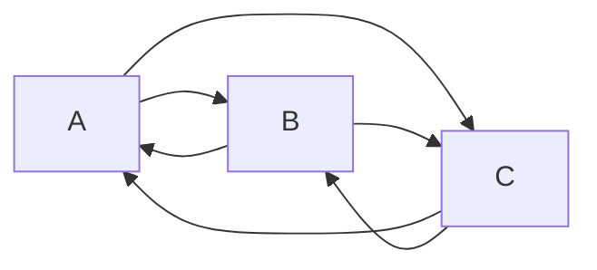
Единственный способ размотать этот клубок, это начать с поверхностного изучения одной из тем, с помощью этого знания изучить другую тему, а потом вернуться к первой чтобы понять ее теперь уже полноценно.
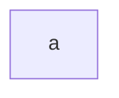
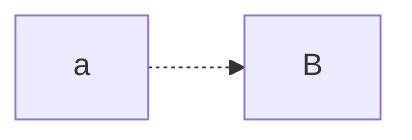
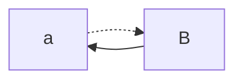

Иными словами бектрекинг неизбежен.  
Для любого набора тем может существовать много вариантов того, с какой стороны начать объяснять и в каком порядке. Я здесь использую тот порядок, который видится лично мне наиболее подходящим.  
К некоторым темам мы будем возвращаться по многу раз, но я постараюсь минимизировать бектрекинг.
## Внешние материалы
Как уже говорилось, в статье я даю ссылки на статьи, доклады с конференций и прочие внешние источники. Зачастую в них встречается какая-то доля одних и тех же вещей. Зачастую их еще и одни и те же люди делают, от чего похожего в них еще больше. Но тем не менее, даже если я приложил два разных источника с почти одинаковой информацией, это не значит что прочитав/посмотрев один можно забить на второй. Текст внутри этой статьи я пишу сам и сам планирую его чтобы решать проблему кольцевых связей. Но подобрать внешние источники так чтобы они идеально вписывались в контекст не получится. Они либо будут бесполезны, рассказывая все то что ты уже знаешь, либо в них будет слишком много нового, помимо топика статьи. Я пытаюсь выдерживать компромисс между этими крайностями, по этому во всех внешних источниках будет как повторение уже изученного, так и часть нового что ты не знаешь и тебе рано это знать. Когда ты видишь местами в статье/докладе термины которые тебе неизвестны и не объясняются, не надо на них зацикливаться. Если я выбрал этот материал для тебя, то в нем есть как минимум часть того что ты уже в состоянии понять и именно эта часть тебе нужна.  
Возвращаясь к проблеме кольцевых зависимостей: для первичного поверхностного ознакомления с темой я часто даю внешний источник ,а уже потом спустя N глав возвращаюсь к теме еще раз, но уже полноценно. Это я все к тому чтобы ты не зацикливался по несколько суток на понимании всего материала из видоса, который по задумке ты должен посмотреть наискосок, усвоить в лучшем случае треть и пойти дальше.
# Язык
Kotlin это язык созданный в 2016 году конторой JetBrains, которая де юре иностранная, но де факто изначально Питерская. Назван в честь острова [Котлин](https://ru.wikipedia.org/wiki/%D0%9A%D0%BE%D1%82%D0%BB%D0%B8%D0%BD) там же под Питером. Основной продукт JetBrains это IDE (среда разработки) [IntelliJ IDEA](https://www.jetbrains.com/idea/), которая на текущий момент является (почти) безальтернативыным инструментом для разработки на java. На ее же основе создана [Android Studio](https://developer.android.com/studio) , которая с официальной подачи Гугла является (почти) безальтернативыным инструментом для разработки под андроид. Так вот и в то и в то, естественно, глубоко интегрирована поддержка Котлина, что и хорошо (язык с самого начала своего существования имеет богатую поддержку в одной из ведущих мировых IDE) и плохо (вне IDEA/Android Studio разработка на Kotlin фактически не существует, а эти к этим средам есть много претензий, начиная от частично закрытых исходников и работы по подписке, до их легендарной тяжеловесности и бесконечной тяге сожрать все ресурсы компа которые только есть).

Kotlin изначально работает на основе JVM(виртуальной машины java) из за чего у него с жавой очень хороший интероп(возможность из одного языка вызывать код на другом языке). Библиотеки на java можно использовать в проектах на Kotlin и наоборот. Из-за этого с момента своего появления Kotlin сразу имеет обширную экосистему из java мира в котором есть библиотеки для вообще всего. Также по скольку JVM работает вообще на всем чем можно, Kotlin тоже получает это свойство. В какой то момент google даже принял Kotlin в качестве официального языка для разработки под андроид.  
Однако к текущему моменту Котлин обзавелся помимо JVM поддержкой кучи других платформ, от транспиляции в JavaScript до компиляции в нативные бинарники. Прямо сейчас прикручивают компиляцию в wasm. Ну и в принципе язык старается стать универсальным.

Также как у Dart'a с Flutter'ом, у котлина есть свой крупный фреймворк для интерфейсов вокруг которого много чего крутится в экосистеме - Compose. Изначально он был создан для андроида (Jetpack Compose), но потом у него появилась кросплатформенная версия(Compose Multiplatform). Сейчас на нем можно и под андроид/ios писать и под десктоп и сайты делать.
# О языках
По примерным оценкам к текущему моменту человечество наплодило около 9000 языков программирования. Они все разные, предназначены для разных задач и следуют разным идеологиям. И тем не менее у них есть одно фундаментально общее: есть некоторый набор команд (код), есть исполнитель который эти команды читает и выполняет, и есть набор правил описывающий возможные команды, их значение и то как исполнитель должен их исполнять.  
Когда то давно, когда один компьютер занимал сарай и стоил как самолет, единственными существовавшими исполнителями и были эти монструозные компы (не учитываем человека считающего ручкой на бумажке). Их физическое устройство диктовало то, какие команды по каким правилам они могут выполнять. Назывались эти правила (да и называются сейчас) `архитектурой` компьютера, а код составленный в соответствии с этими правилами `машинным кодом`. Этот `машинный код` существовал в двоичном коде который выбивали на перфокартах. Дырка есть - единица, дырки нет - ноль (ну или наоборот в зависимости от конкретной машины).
![[attachments/Pasted image 20231110200119.png]]  
Раньше `архитектур` было столько же сколько и машин потому что каждую проектировали и создавали с нуля. Сейчас их поменьше потому что появились стандартные вроде `x86(64)`(десктопное железо) или `arm`(телефоны, малинки и в целом любое носимое железо и железо с низким энергопотреблением), но их все еще больше одной и периодически появляются новый вроде `RISK-V`.  
Процесс выполнения любого кода любым исполнителем (и человеком на бумажке) называется `интерпретацией`(interpretation), хотя в отношении выполнения `машинного кода` железом обычно говорят просто "исполнение"(execution).  
Ну писать программы в двоичных кодах и выбивать их на перфокартах это очевидно не самый удобный способ программирования, а главное очень долгий и очень подверженный ошибкам. Хотелось иметь более человечный способ говорить машине что ей делать. Так возникла идея писать команды текстом используя обычные английские слова и так появились `языки программирования`. Помимо человекопонятного текстового ([хотя иногда и графического](https://www.rabbitremix.com/)) представления ЯП также позволяют навернуть дополнительных слоев абстракций упрощающих работу программисту. Однако процессор понимать текстовые ЯП не умеет ([хотя были прецеденты](https://ru.wikipedia.org/wiki/%D0%9B%D0%B8%D1%81%D0%BF-%D0%BC%D0%B0%D1%88%D0%B8%D0%BD%D0%B0)), по этому очевидной является идея как-то сконвертировать код на человекочитаемом ЯП в `машинные коды` понятные железу. Этот процесс называется `компиляцией`, а программы которые его осуществляют - `компиляторами`.  
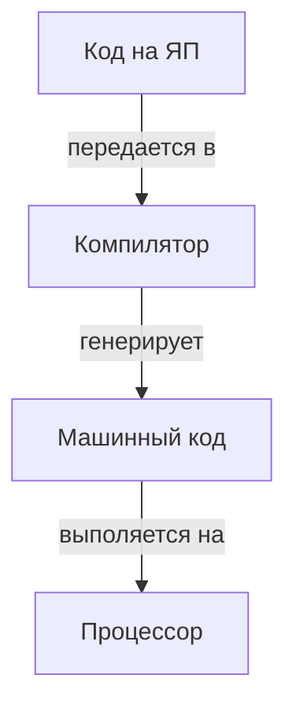
Не смотря на то что `компиляторы` позволили людям использовать для написания программ высокоуровневые ЯП, осталось множество проблем. Во первых, для каждого языка требовалось написать `компилятор` под каждую `архитектуру` (хотя некоторые `компиляторы` умели в сборку под несколько `архитектур`, внутри них все равно была отдельная логика для каждой из них), а это все еще были темные времена когда `архитектур` было столько же сколько и машин. Во вторых, в те времена ЯП еще были не сильно абстрагированы от особенностей работы железа и для написания кроссплатформенного кода (кода который можно было бы `скомпилировать` под множество `архитектур`) нужно было знать довольно много нюансов работы железа, причем разного.  
Для решения этих проблем придумали очередную идею. Можно ведь написать программу которая будет `скомпилирована` в `машинные коды` (или изначально в них написана) и исполняться железом, но которая при этом сама будет читать код на каком-то ЯП и самостоятельно же его исполнять. Такие программы назвали `интерпретаторами`, а языки разделились на предназначенные для `компиляции` в `машинные коды` - `компилируемые`(C, C++, Rust, Go) и языки предназначенные для выполнения программами-интерпретаторами - `интерпретируемые`(bash). Существует также ряд языков которые ошибочно причисляют к `интерпретируемым` (python, JavaScript, lua). Почему они такими не являются мы рассмотрим чуть ниже.  
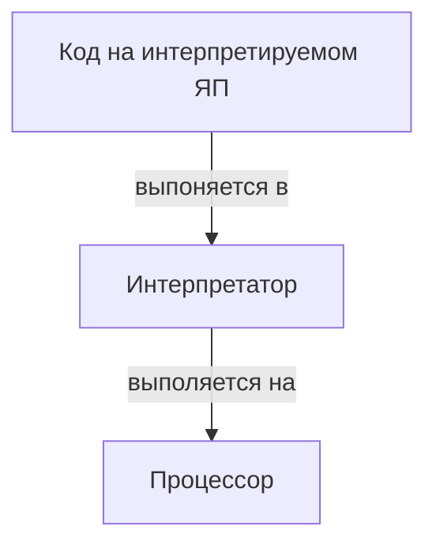
Создание `интерпретируемых` языков позволило, вместо того чтобы писать по `компилятору` для каждой `архитектуры`, написать один раз `интерпретатор` языка и `скомпилировать` его под все нужные платформы (платформа=ОС+`архитектура` железа). Также в `интепретируемых` языках стало возможным сильное абстрагирование от особенностей железа и, соответственно, упрощение жизни для программиста. Но вместе с тем пришел ряд издержек:
- Программы на `интерпретируемых` языках требовали, собственно, `интерпреатора` для своего запуска, в то время как `компилируемые` языки после `компиляции` превращались бинарник готовый к исполнению железом и ОС.
- Программы на `интерпретируемых` языках были слишком абстрагированы от железа, так что с этим самым железом на них было проблематично работать. ОС на таком языке не напишешь.
- `Интерпретация` кода программой это процесс куда менее быстрый чем исполнение `машинного кода` железом
Вот из-за последнего пункта возникла еще одна идея: можно создать код на подобие `машинного`, который также был бы бинарным и оптимизированным для выполнения, но при этом не связанным с какой бы то ни было конкретной `архитектурой`. Тогда, можно было бы создать языки `компилирующиеся` не в кучу разных `машинных кодов`, а только в один такой код, который уже в свою очередь будет исполняться `интерпретатором`(ами). Так появились `байткоды`(bytecode). А `интерпретаторы` `байткодов` назвали `виртуальными машинами`(virtual machine aka VM). К слову термин `VM` имеет это значение только в этом контексте, в других контекстах он применяется в другом смысле(их мы возможно тоже рассмотрим в этой статье).  
Теперь схема стала такой:
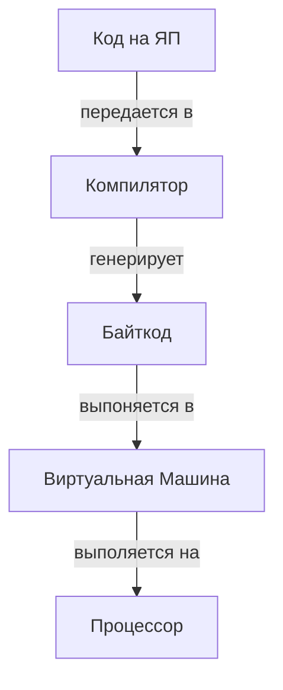
Этот гибридный подход сочетает сильные стороны и `компиляции` и `интерпретации`: язык абстрагирован от железа и не требует для себя создания пачки `компиляторов` под разные `архитектуры`, но при этом исполняется достаточно быстро и эффективно. Именно таким образом и работают языки Java, JavaScript, Python, Lua и еще многие другие. Но если в случае Java промежуточный `байткод` это основная и явная часть дизайна языка, то в случаях JS/Python/Lua, он является лишь оптимизацией скрытой под капотом `интерпретатора` и не заметной не достаточно пытливому программисту. По этой причине многие считают тот же питон чисто `интерпретируемым` языком.  
В большинстве случаев `байткоды` создаются специально для конкретного языка чтобы извлечь наибольшую пользу из гибридного подхода. Но иногда `байткодом` уже существующего языка начинают пользоваться языки новые. Так `байткодом` и `виртуальной машиной` Java(JVM) пользуются языки Clojure и Scala.
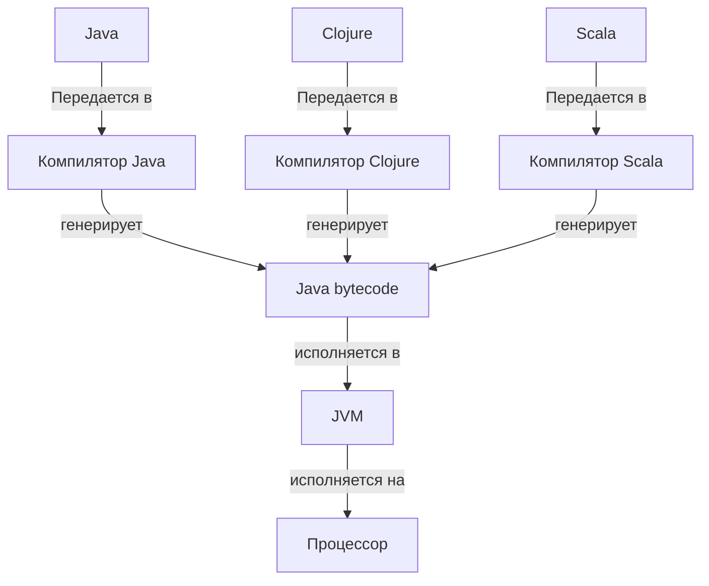
К слову разделение языков на `интерпретируемые` и `компилируемые` ооочень условно не только по причине существования гибридной схемы с `байткодом`. Дело еще в том что это разделение отражает лишь способ исполнения для которого задумывался язык. Абсолютно ничего (кроме здравого смысла) не мешает тебе написать `интерпретатор` C++ или `компилятор` баша в `машинные коды`. И да, нашлись люди которые это уже сделали. Более того, существуют языки которые изначально задуманы создателями и для `компиляции` и для `интерпретации`.  
Казалось бы, мы рассмотрели все способы исполнения разных кодов и конвертации между ними. Но нет, ведь можно еще и сконвертировать код на одном `ЯП` в код на другом `ЯП`. Это называется `транспиляцией`. Но зачем такое может быть кому-то нужно?
- Авторы языка не хотят писать свой `компилятор`, или хотят написать его позже, когда окончательно определяться с дизайном языка. В таком случае они могут написать `транспилятор` своего языка в какой ни будь другой `компилируемый` язык. Так изначально поступил создатель С++ Бьёрн Страуструп, написавший `транспилятор` своего языка в обычный C. Самостоятельные `компиляторы` C++ появились уже позже. Также поступили разработчики языка Nim. Их язык тоже `транспилируется` в C, но у них это не временный костыль а дизайнерское решение. А еще я знаю чела который пилит язык `транспилирующийся` уже в сам Nim, просто потому что может.
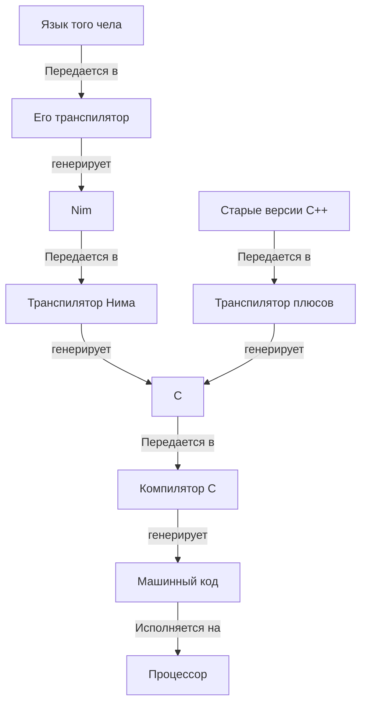
- Авторы языка создают не полностью самостоятельный язык, а надстройку над другим языком лишь немного его улучшающую. Таким языком например является язык TypeScript который является надстройкой над JavaScript, добавляющей сложную систему типов и статических проверок(сейчас нам не важно, что это).
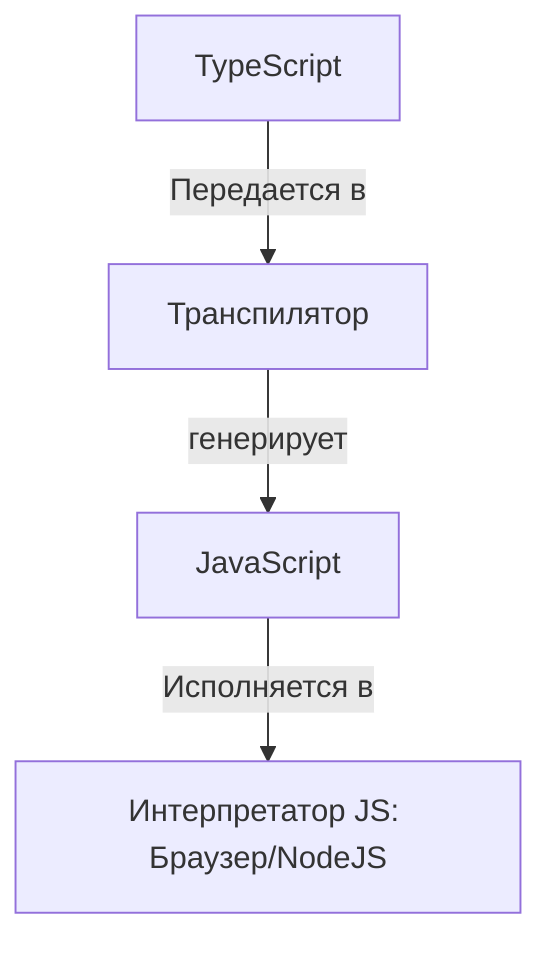
- Есть только один язык который может использоваться в некоторой среде. Примером такой среды является браузеры, в них можно исполнять только богомашиномерзкий JS(хотя прямо сейчас этот status quo наконец-то меняется). И если авторы других языков хотят, чтобы их язык мог исполняться в браузере им нужно сделать `транспилятор` своего языка в JS. Примерами таких языков являются ClojureScript(диалект языка Clojure) и Dart(когда на нем создаются браузерные программы)
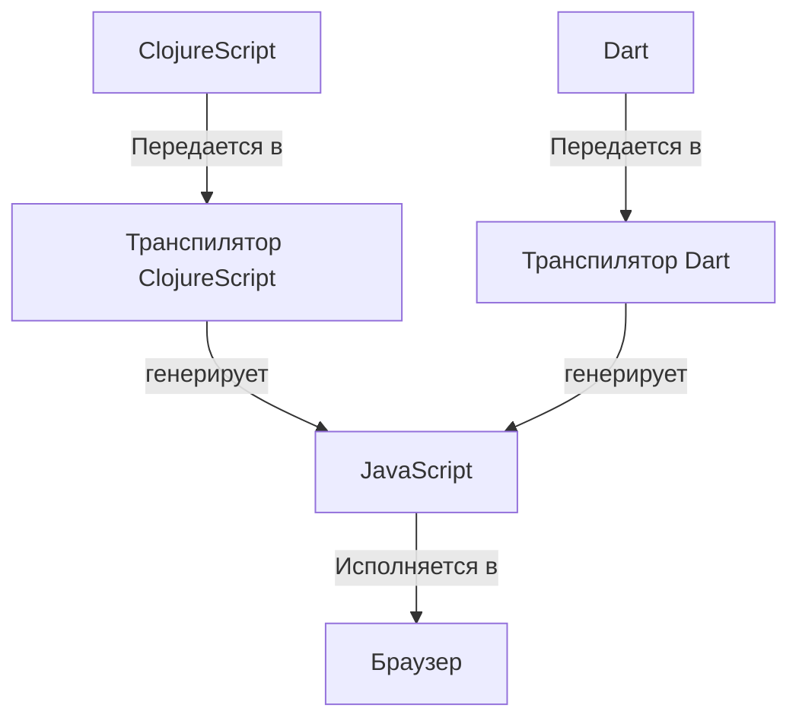
- Есть версии языка сильно различающиеся друг от друга, так что код на одной версии языка не будет работать на другой. Так например для питона существует `транспилятор` для перевода проектов с давно устаревшей второй версии языка на актуальную третью. Но особенно это явление распространено в проклятом всеми богами мире JS, где обратную совместимость между версиями языка ломают постоянно и без предупреждения и чтобы это как-то сдерживать есть отдельный инструмент `транспиляции` между версиями JS - [Babel](https://babeljs.io), который достаточно сложный чтобы аж иметь встроенную систему плагинов.

Кстати, на самом деле каноничные определения `компиляции` и `транспиляции` немного отличаются от тех, что я дал выше. Официально, `транспиляция` это преобразование кода между `языками`/`байткодами`/`машинными кодами` с сохранением уровня абстракции, а `компиляция` это преобразование с уменьшением уровня абстракции. То есть если мы перегоняем код из какого-ни будь очень высокоуровнего `байткода` в какой-то очень простой и низкоуровневый `ЯП`, то правильно это называть `компиляцией`. И если мы перегоняем высокоуровневый Nim в куда менее высокоуровневый C то это тоже `компиляция` а не `транспиляция`. Но это все официально. На деле же, как правило, `компиляцией` называют перевод из человекочитаемого `ЯП` в `байткод`/`машинный код`, а `транспиляцией` называют перевод с одного `ЯП` на другой (или между версиями одного `ЯП`).  
На фоне всего зоопарка `ЯП`, обособленно стоят `ассемблеры`. `Ассемблеры` это языки предназначенные для `компиляции` в один конкретный вид `байткода`/`машинного кода` и очень сильно на него похожие, т.е. не содержащие дополнительных абстракций. Инструкции `ассемблера` (почти) 1к1 транслируются в `опкоды`(operation codes - так называются инструкции в `байткодах` и `машинных кодах`). `Ассемблеры` были первыми `языками программирования` как таковыми и, фактически являются единственными `ЯП` низкого уровня. Все что выше, включая сишечку, это уже `ЯП` высокого уровня. `Компиляция` `ассемблера` в соответствующий ему `байткод`/`машинный код` называется `ассемблированием`, а программа которая делает `ассемблирование` `ассемблера` называется ... тоже `ассемблером` (потому что однозначность терминов для слабых духом видимо).  
  
Чтобы все еще сильнее запутать, рассмотрим `динамическую компиляцию`. Использование `байткодов` как промежуточный формы между `интерпретацией` `ЯП` напрямую и `компиляцией` в `машинные коды` позволило поднять производительность `интерпретируемых` `ЯП` до приемлемого уровня. Однако она все еще была бесконечно далека от производительности `скомпилированных` программ. И тогда люди придумали ... `компилировать` программы ... во время `интерпретации` ...  
На самом деле в этом больше смысла, чем кажется на первый взгляд. Многие `интерпретируемые` языки устроенны так что `компиляция` их целиком невозможна или как минимум непрактична. По этому при использовании `динамической компиляции`, `компилируются` только небольшие части программы, для которых это возможно и имеет смысл. Но даже при этом те же части программы доступны для исполнения в `интерпретируемом` режиме. Сложно пояснить это на примере на текущем этапе, но я попробую. В программе может быть какой то кусок кода, который может работать с любыми данными, со строками, числами и прочим. По скольку до запуска кода неизвестно что за данные будут попадать туда в процессе работы, нельзя предварительно `скомпилировать` такой код, ведь нам бы пришлось отдельно собрать `скомпилированную` версию этого кода для каждого из множества возможных типов данных. Однако в процессе выполнения этого кода `интерпретатор` может, скажем, обнаружить что этот код часто работает с числами и `скомпилировать` только его версию для работы с числами. А при попытке выполнить этот код с другими типами данных (например строками), будет происходить обычная `интерпретация`.  
Также `динамическая компиляция` позволяет учитывать особенности железа конкретной машины на которой программа работает. И также она может учитывать профили нагрузки (т.е. смотреть какие участки кода выполняются чаще всего, выполнение каких участков занимает больше всего времени, с какими данными работает программа итд).  
Существует два распространенных подхода к `динамической компиляции`: `JIT` и `AOT`.  
При `JIT`(Just In Time) подходе программа запускается в обычном режиме `интерпретации`, но в процессе работы `интерпретатор` наблюдает за ее работой, трассирует программу(собирает данные о ее работе) и на основании полученной информации `компилирует` и `перекомпилирует` части кода программы. Этот подход позволяет оптимизировать работу программы по ходу дела ровно под те нагрузки с которыми она сталкивается прямо сейчас. Однако при таком подходе программа со старта работает медленно, но постепенно разгоняется (хотя на современном железе время за которое `JIT` успевает разогнаться уже незаметное). Также при таком подходе работа `JIT` `компилятора` сама по себе занимает какое-то количество ресурсов процессора и памяти.  
При `AOT`(Ahead Of Time) подходе, после запуска программа сначала частично или полностью `компилируется` и уже потом начинает работать без изменений в процессе. Такой подход хорош тем, что в процессе работы программы нету лишней нагрузки которую создает работа `JIT` `компилятора`, да и реализовать `AOT` `компилятор` куда проще чем `JIT`. Однако при `AOT` `компиляции` не могут учитываться профили нагрузки в реальном времени. Это обычно `компенсируется` тем, что профили собираются в процессе работы и сохраняются на диск, и при запуске, `AOT` `компилятор` учитывает профили оставшиеся с прошлого(ых) запуска(ов). `AOT` применяется, например, в `VM` Dalvik, от гугла, которая используется для запуска Java приложений в андроиде (точнее использовалась до недавнего времени).  
Но имеет место не только проникновение практик `компиляции` в `интерпретируемые` языки, но и наоборот. Фундаментальной проблемой `компиляции` было то, что для каждого языка надо было написать по `компилятору` под каждую аппаратную `архитектуру`. Это известно как проблема `M*N`: при наличии `M` языков и `N` архитектур нужно написать `M*N` компиляторов.
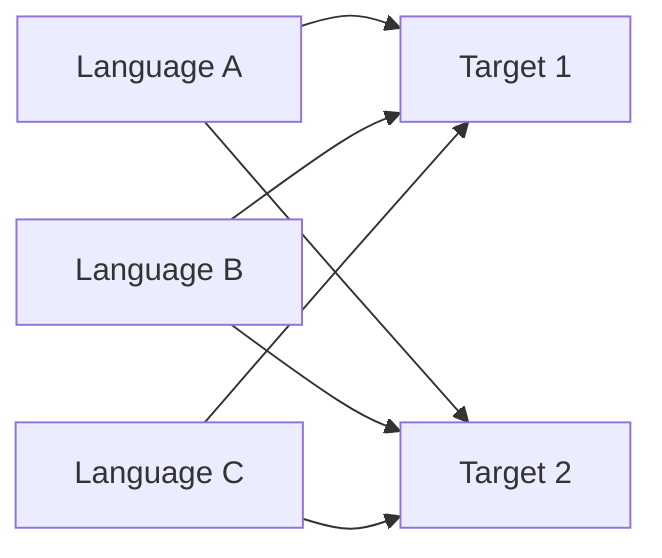
Вот бы было некоторое промежуточное представление в которое можно было бы `скомпилировать язык`, а потом это представление уже `компилировать` под все `архитектуры`. Тогда нужно было бы написать по одному `компилятору` из каждого языка в это представление и по одному `компилятору` этого представления в целевые `машинные коды`. Тогда вместо `M*N` получилось бы `M+N`.
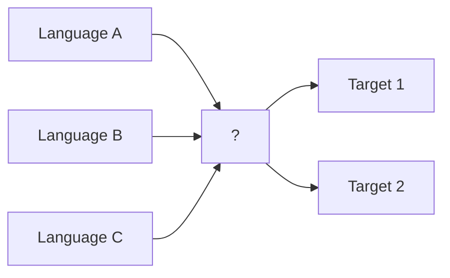
Звучит как ... `байткод`.  
Ну и да такой появился. А точнее появился целый `тулчейн`(tool chain) - `LLVM`. Изначально этот проект создавался для вообще других целей (впрочем и ютуб задумывался как сайт знакомств), но в итоге все пришло к созданию байткода `LLVM IR`, который и является тем самым промежуточным представлением (IR - Intermediate Representation). `Компиляторы`, собирающие исходный код на `языках программирования` в `LLVM IR` называются `фронтенды`, а `компиляторы` `IR` в `машинные коды` целевых `архитектур` - `бекенды`. 
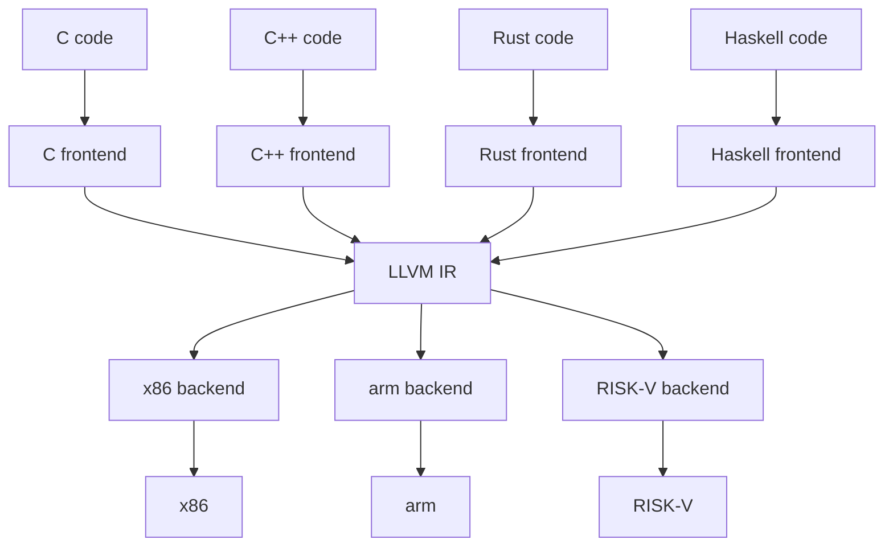
Похожий подход использует язык GO, хотя его `компилятор` не использует `LLVM`, но у него есть собственное промежуточное представление в виде GO `ассемблера`. Этот `ассемблер` по сути также как LLVM IR является архитектуро-независимым `байткодом` используемым как промежуточная стадия в `компиляции`.  
  
Ну и наконец `wasm`. У современного веба много проблем, но одна из основных это JS. И дело не столько в том что это так себе язык накостылянный одним человеком за десять дней для того чтобы писать на нем прикольные анимации, но который теперь используется для высоконагруженных приложений. Дело в том что это ЕДИНСТВЕННЫЙ язык который поддерживается для написания логики в вебе. Все остальные языки могут разве что `транспилироваться` в JS. Как бы все не делали вид что все в порядке, необходимость в другом способе крутить логику в вебе была и на этот раз к этой задаче надо было подойти обстоятельно.  
Нужен был формат который был бы
- Портативным. Программы в этом формате должны были одинаково работать в браузерах на всех платформах и аппаратных архитектурах
- Безопасным. Программы в этом формате должны работать в изолированной песочнице и не иметь доступа к внешнему миру
- Быстрым. Одна из проблем JS это скорость, так что новый формат должен ее решать.
- Не привязанный к конкретному языку (language-agnostic). Формат не должен быть ориентирован на какой-то конкретный язык (как Java `байткод` на Java), а быть универсальной целью для компиляции любых компилируемых языков.
В течении долгого времени на эту роль пробовали разные решения включая `LLVM IR`, но в итоге разработчики основных браузеров собрались в консорциум и разработали новый байткод специально для этой задачи - `wasm`. На текущий момент он поддерживается всеми барузерными движками и в него можно компилировать как минимум C, C++, Rust, Zig, Go (это только из того что я видел на практике).
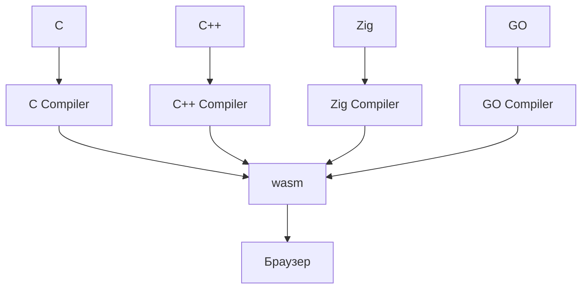
Но если бы `wasm` был применим только в вебе как альтернатива JS, он не был бы *так* интересен. Не смотря на то, что `wasm` создавался для веба, его задизайнили на столько хорошо, что к вебу он никак принципиально не привязан и может использоваться для встраивания кода и где угодно. Например хочу я добавить в свое приложение поддержку плагинов. Раньше у меня было два варианта
- Встроить `интерпретатор` какого-то языка. Но тогда плагины можно было бы писать только на нем
- Реализовать плагины как отдельные программы которые ставятся рядом и взаимодействуют с моим приложением через IPC. Но в таком случае теряется портативность и каждый из плагинов требует поддержки как самостоятельная программа т.е. его надо портировать под каждую ОС и каждую архитектуру на которой работает мое приложение. Если вдруг приложение станет поддерживать новую ОС или архитектуру, то там не будут доступны плагины, до тех пор пока авторы не портируют их и туда (если они вообще это станут делать).
С приходом `wasm` же появляется третий вариант: можно встроить в приложение виртуальную машину `wasm` и компилировать в него все плагины. В таком случае любой из них будет кросплатформенным и портативным, но при этом их можно будет писать на любом языке который можно засунуть в `wasm`.


Итого:
- `архитектура` (в данном контексте) - набор конструкционных особенностей железа, определяющий особенности работы и язык `машинных кодов` на котором для него можно описывать логику. Примеры: x86-64(десктопы, сервера), arm(телефоны, одноплатники, в целом устройства с низким энергопотреблением; с недавних про пробирается на десктопы и сервера и планомерно вытесняет x86), RISK-V(молодая открытая `архитектура`, пока что существует больше по приколу, но постепенно пробирается в изначальную нишу arm)
- `машинный код` - язык команд который понимает железо, зависит от его `архитектуры`. В основном бинарный, но были исключения.
- `язык программирования` aka `ЯП` - обычно текстовый, язык команд, созданный для написания и чтения человеком. Как правило содержит высокоуровневые абстракции.
- `компиляция` - процесс "перевода" между `ЯП`, `машинными кодами`, `байткодами` и в целом любыми формами записи логики
- `компиялтор` - программа, осуществляющая `компиляцию`
- `интерпритация` - исполнение логики программы описанной на `ЯП`, в машинных кодах в `байткоде` итд
- `интерпретатор` - обычно программа выполняющая `интерпретацию`, но в целом любой исполнитель любого кода в.т.ч. компьютер или человек считающий на бумажке.
- `ассемблер` - `язык программирования` предназначенный для `компиляции` в `машинный код` какой-то конкретной `архитектуры` или в какой-то конкретный `байткод` (бывают исключения вроде GO asm). Обычно не содержит или содержит мало дополнительных абстракций. Также `ассемблером` называют программу-`компилятор` языка `ассемблера`.
- `ассемблирование` - процесс `компиляции` `ассемблера` (языка) в целевой `байткод`/`машинный код`
- `байткод` - низкоуровневый бинарный код, схожий с `машинными кодами`, однако не связанный ни с какой конкретной `архитектурой`. Обычно создается в качестве промежуточного звена при `интерпретации` или `компиляции` `ЯП`. Обычно создается специфично под конкретный язык, но может быть и универсальным как `wasm` или `LLVM IR`.
- `виртуальная машина` (в данном контексте) - программа, исполняющая `байткод`.
- `транспиляция` - "перевод" кода с одного `ЯП` на другой.
- `динамическая компиляция` - частичная `компиляция` `интерпретируемой` программы `интерпретатором`
- `JIT` - подход к `динамической компиляции`, при котором в процессе `интерпретации` собирается информация о работе программы и на основе нее, код частично или полностью `компилируется` и многократно `перекомпилируется` по ходу работы
- `AOT` - подход к `динамической компиляции`, при котором `компиляция` происходит единожды сразу после старта программы. При этом может использоваться информация о программе, собранная во время предыдущих запусков.
- `LLVM` - набор инструментов для создания `компиляторов`, построенный вокруг использования `байткода` `LLVM IR` в качестве промежуточного этапа `компиляции`.
- `фронтенд` (в данном контексте) - `компилятор` преобразующий `ЯП` в `LLVM IR`
- `бекенд` (в данном контексте) - `компилятор` преобразующий `LLVM IR` в нативные `машинные коды` или другие `байткоды` (например `wasm`)
- `wasm` - портативный языко-независимый `байткод` созданный для исполнения программ на произвольных языках в браузере. Поддерживает как цель `компиляции` у многих языков. Не смотря на изначальную ориентированность на браузеры, может использоваться для встраивания логики где угодно. Потенциально идеальная основа для создания систем плагинов в приложениях.


